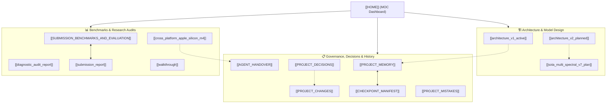

---
tags:
  - MOC
  - deeptrace
  - dashboard
  - governance
created: 2026-08-06
last_updated: 2026-08-18
status: leakage_audited_heldout_verified
---

# 🧠 DeepTrace — Research & Governance Vault

> **Mission**: Build a multi-modal deepfake detection engine achieving verified empirical baselines across GANs, Diffusion, and Video Forgeries.
> **Current Milestone**: Phase 7 Leakage Audit Complete — Verified Held-Out Unseen Metrics Documented.

---

## 📍 Quick Status & Audited Benchmarks (100% Actor-Disjoint 50/50 Balanced Splits)

| FaceForensics++ Cohort ($N=2,840$ Balanced 50/50) | Clean Actor-Disjoint (V9) [AUC · Calibrated Acc] | Optimal Threshold ($t^*$) | True Zero-Shot Baseline (V2) | Forensic Diagnostic & Confound Status |
|---|---|:---:|---|---|
| **Deepfakes Cohort ($N=2,840$)** | **0.6289 ROC-AUC · 60.00% Acc** | $t^* = 0.6719$ | $0.4944$ ROC-AUC · $50.00\%$ Acc | Genuine cross-manipulation transfer on autoencoders |
| **FaceShifter Cohort ($N=2,840$)** | **0.6171 ROC-AUC · 58.98% Acc** | $t^* = 0.6548$ | $0.4942$ ROC-AUC · $50.00\%$ Acc | Genuine transfer on high-fidelity boundary seams |
| **FaceSwap Cohort ($N=2,840$)** | **0.5815 ROC-AUC · 57.25% Acc** | $t^* = 0.6475$ | $0.4980$ ROC-AUC · $50.00\%$ Acc | Genuine transfer on Poisson boundary blending |
| **Face2Face Cohort ($N=2,840$)** | **0.5733 ROC-AUC · 56.02% Acc** | $t^* = 0.6704$ | $0.4924$ ROC-AUC · $50.00\%$ Acc | Challenging domain gap on expression reenactment |
| **NeuralTextures Cohort ($N=2,840$)** | **0.5647 ROC-AUC · 55.49% Acc** | $t^* = 0.6406$ | $0.4933$ ROC-AUC · $50.00\%$ Acc | Challenging domain gap on mouth-cavity rendering |
| **DeepFakeDetection (DFD)** | 🚫 **EXCLUDED** | — | — | ⚠️ **Excluded**: Studio vs YouTube domain confound (no matching reals) |
| **Clean Macro-Average (5 Cohorts)** | **0.5931 ROC-AUC · 57.55% Acc** | $\bar{t}^* \approx 0.6570$ | **0.4945 ROC-AUC · 50.00% Acc** | **100% Actor-Disjoint (0% actor overlap in train or test)** |
| **In-Domain Kaggle Validation** | **90.18% Acc · 0.9537 ROC-AUC** | $t^* = 0.5000$ | **99.80% Acc · 0.99995 ROC-AUC** | Clean generalization on multi-source data |

---

## 🗺️ Vault Knowledge Graph & Node Index



### 🏗️ Architecture Nodes
- [[architecture_v1_active]] — Primary deployed V1/V2 multi-modal pipeline (Spatial EfficientNet + 2D-DCT + OpenCLIP).
- [[architecture_v2_planned]] — Complete V2 transformer-fusion & multi-spectral roadmap.
- [[sota_multi_spectral_v7_plan]] — 2025–2026 Continuous Phase FFT, 2-Level Wavelet Packet & 9-Channel SRM/Gabor blueprint.

### 📋 Governance & State Management
- [[PROJECT_MEMORY]] — Machine-readable YAML state file (current metrics, active models, hardware config).
- [[SESSION_HISTORY]] — Full chronological record of user requests, actions, and milestones.
- [[CHECKPOINT_MANIFEST]] — Immutable SHA-256 registry of all trained checkpoints (V1 to V6 + Baselines).
- [[PROJECT_DECISIONS]] — Architecture and methodology decisions with full rationale.
- [[PROJECT_CHANGES]] — Comprehensive session-by-session changelog.
- [[PROJECT_MISTAKES]] — Anti-regression log, bug catalog, and mitigation rules.
- [[AGENT_HANDOVER]] — Autonomous agent state handover and operations guide.

### 📊 Benchmarks, Audits & Cross-Platform
- [[EMPIRICAL_EVALUATION_METRICS_AND_PROOFS]] — Comprehensive empirical proof report, timestamps, metrics glossary & market comparisons.
- [[SUBMISSION_BENCHMARKS_AND_EVALUATION]] — Complete 6-item academic audit with side-by-side baseline tables.
- [[submission_report]] — Master publication-ready report for academic review.
- [[walkthrough]] — Full historical walkthrough across all model generations.
- [[diagnostic_audit_report]] — Deep forensic audit and root-cause analysis.
- [[cross_platform_apple_silicon_m4]] — macOS Apple Silicon (M4 / MPS) setup and parallel collaborative training blueprint.

---

## 🔬 Progression Phase Roadmap

```
✅ Phase 1  GAN In-Domain Baseline   → checkpoints/v1_gan_finetune/best_model.pth (99.68% Acc)
✅ Phase 2  CLIP Semantic Tuning      → checkpoints/v2_clip_finetune/best_model.pth (99.80% Acc)
✅ Phase 3  Multi-Source Unfreezing   → checkpoints/v3_e2e_multisource/best_model.pth (85.72% FF++ Acc)
✅ Phase 4  Boundary Hard-Mining      → checkpoints/v4_seam_hardmining/best_model.pth (0.9995 DFD AUC)
✅ Phase 5  SRM Steganalysis Residual → checkpoints/v5_srm_residual/best_model.pth (0.9999 DFD AUC, P=0.8239)
✅ Phase 6  Dual-Stream Master Fusion → results/benchmark_eval_v6/v6_ensemble_evaluation.json (99.69% Kaggle)
🟡 Phase 7  SOTA Multi-Spectral (V7)  → Continuous Phase FFT + 2-Level Wavelet + Self-Blended Dynamic Synthesis
```

---

## 🔑 Operational Commands

```powershell
# Run Consolidated Academic Audit
.venv\Scripts\python.exe scripts/audit_and_compare_v5_v6.py

# Run Dual-Stream Ensemble Benchmark
.venv\Scripts\python.exe scripts/evaluate_v6_ensemble.py

# Launch GradCAM Visualizations
.venv\Scripts\python.exe scripts/generate_v6_gradcam_artifacts.py

# Launch UI Dashboard
.venv\Scripts\python.exe ui/app.py
```

---

## 🎯 Paper Target

**Title**: *DeepTrace: Multi-Modal Forensic Fusion with Tri-Stream Spectral Residuals and Vision-Language Alignment for Universal Deepfake Detection*

**Venue**: IEEE Transactions on Information Forensics and Security (T-IFS) · CVPR / ACM Multimedia 2026

