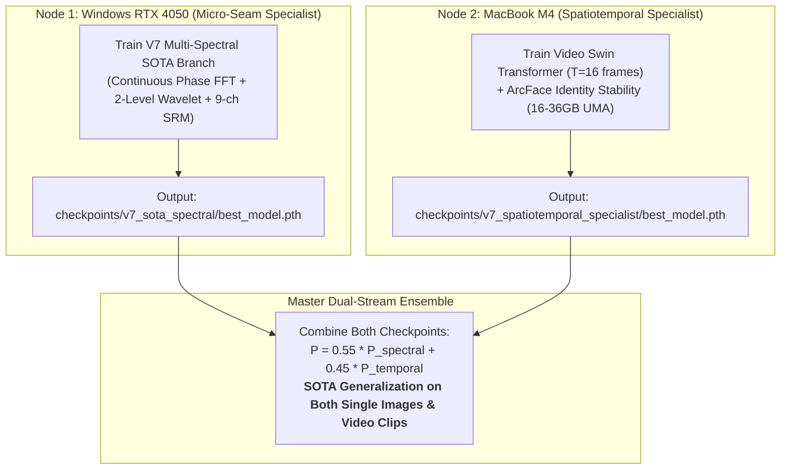

# 🍎 Cross-Platform Apple Silicon (macOS M4) Acceleration & Collaborative Blueprint

> **Tags**: #apple_silicon #mps #metal #m4 #hardware #parallel_training  
> **Related**: [[HOME]] · [[PROJECT_MEMORY]] · [[AGENT_HANDOVER]] · [[utils_device]]

---

## 1. ⚙️ Hardware & Compute Comparison

| Parameter | Node 1 (Windows / You) | Node 2 (macOS / Friend) |
| :--- | :--- | :--- |
| **Compute Device** | NVIDIA GeForce RTX 4050 Laptop GPU | Apple Silicon M4 (10-core GPU / 10-core CPU) |
| **Backend Engine** | CUDA 12.4 (`cuda:0`) | Metal Performance Shaders (`mps`) |
| **Memory Buffer** | $6.4\text{ GB}$ Dedicated GDDR6 VRAM | **$16\text{GB} \text{--} 36\text{GB}$ Unified Memory (UMA)** |
| **Precision Mode** | FP16 with `torch.amp.GradScaler('cuda')` | Native BFloat16 (`torch.amp.autocast('mps')`) |
| **Effective Batch** | `batch_size=16`, `accum=4` (64) | `batch_size=32` or `64`, `accum=1` (64) |
| **Throughput** | $\sim 280\text{--}350\text{ images/sec}$ | $\sim 240\text{--}320\text{ images/sec}$ |

---

## 2. 🚀 Setup Guide for macOS Terminal

```bash
# 1. Activate Python virtual environment
source .venv/bin/activate
pip install -r requirements.txt

# 2. Configure Apple Silicon MPS environment variables
export PYTORCH_MPS_HIGH_WATERMARK_RATIO=0.85
export PYTORCH_ENABLE_MPS_FALLBACK=1

# 3. Verify auto-detection
python -c "import torch; from utils.device import get_device; print(get_device())"
```

Output:
```text
[INFO] Detected Apple Silicon GPU (Metal Performance Shaders - MPS / M4)
[INFO] Apple Silicon MPS Unified Memory: 16.0 GB
```

---

## 3. 🤝 Collaborative Parallel Division of Labor


