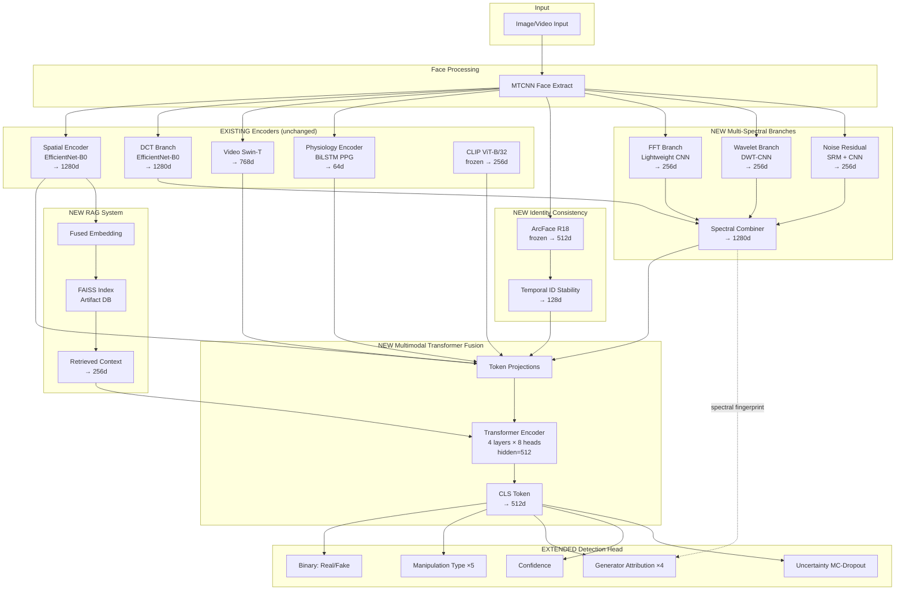

# Architecture Expansion: Advanced Deepfake Detection System

Extend the existing 51.7M-parameter multimodal detector with 10 research-grade improvements while maintaining RTX 4050 (6GB VRAM) compatibility.

> [!IMPORTANT]
> All changes are **additive extensions** — no existing modules are removed or rewritten. New modules plug into the existing [DeepfakeDetector](file:///c:/Users/Udit/Desktop/deepfake1/models/detector.py#23-245) via a new `DeepfakeDetectorV2` wrapper.

---

## Updated Architecture Diagram



---

## Proposed Changes

### Component 1: Multi-Spectral Frequency Analysis

Extends the existing single-DCT [FrequencyEncoder](file:///c:/Users/Udit/Desktop/deepfake1/models/frequency_encoder.py#15-71) with 3 parallel branches.

#### [NEW] [spectral_branches.py](file:///c:/Users/Udit/Desktop/deepfake1/models/spectral_branches.py)

Three lightweight CNN branches running in parallel:

| Branch | Input | Network | Output |
|---|---|---|---|
| **FFT** | 2D FFT magnitude+phase (2ch) | 4-layer CNN (16→32→64→128) + GAP | 256d |
| **Wavelet** | DWT coefficients LL,LH,HL,HH (4ch) | 4-layer CNN (16→32→64→128) + GAP | 256d |
| **Noise Residual** | SRM high-pass filtered (3ch) | 4-layer CNN (16→32→64→128) + GAP | 256d |

**Spectral Combiner** concatenates all 4 branches (DCT 1280d + FFT 256d + Wavelet 256d + Noise 256d = 2048d) → Linear → 1280d, replacing the original frequency encoder output with a richer signal.

**VRAM cost:** ~2.8M params × FP16 ≈ 5.6MB — negligible.

---

### Component 2: Identity Consistency Encoder

#### [NEW] [identity_encoder.py](file:///c:/Users/Udit/Desktop/deepfake1/models/identity_encoder.py)

- **ArcFace ResNet-18** (frozen, pretrained on face recognition) → 512d per frame
- **Temporal ID Stability Module:** Computes pairwise cosine similarity across T frames → 1-layer MLP → 128d stability vector
- High identity variance across frames = likely deepfake (flickering identity)

**Connection:** Identity features (128d) become a new token in the multimodal transformer fusion.

**VRAM cost:** ~11M frozen params (no gradients stored) + ~0.1M trainable ≈ 22MB frozen + negligible trainable.

---

### Component 3: Generator Fingerprint Head

#### [NEW] [generator_head.py](file:///c:/Users/Udit/Desktop/deepfake1/models/generator_head.py)

New prediction branch added to the detection head:

- Input: spectral combiner output (1280d) — spectral domain carries generator fingerprints
- Network: Linear(1280→256) → ReLU → Dropout → Linear(256→4)
- Classes: `GAN`, `Diffusion`, `FaceSwap`, `Unknown`

**Training:** Cross-entropy loss (only on fake samples). Dataset labels mapped from manipulation_type → generator_type. Trained jointly starting Stage 3.

---

### Component 4: RAG Deepfake Artifact Retrieval

#### [NEW] [rag_retrieval.py](file:///c:/Users/Udit/Desktop/deepfake1/models/rag_retrieval.py)

**Embedding Storage:** FAISS `IndexFlatIP` (inner product) storing 512d L2-normalized embeddings.

**Database Population:**
1. After training Stage 2, extract spatial+frequency fused embeddings from all training samples
2. Project to 512d via learnable projection
3. Store in FAISS index with metadata (label, manipulation_type, generator_type, dataset_source)

**Retrieval at Inference:**
1. Extract query embedding from current sample
2. FAISS top-k=8 nearest neighbor search
3. Aggregate retrieved embeddings via attention-weighted mean → 256d context vector
4. Feed into multimodal transformer as an additional token

**Knowledge Base Schema** (JSON metadata per entry):
```json
{
  "embedding_id": 12345,
  "label": "fake",
  "generator_type": "GAN",
  "manipulation_type": "Deepfakes",
  "dataset": "FaceForensics++",
  "artifact_type": "boundary_artifact",
  "spectral_signature": "high_freq_attenuation",
  "similarity_score": 0.94
}
```

#### [NEW] [knowledge_base.py](file:///c:/Users/Udit/Desktop/deepfake1/models/knowledge_base.py)

Manages the artifact database: build, save, load, query operations. Stores index + metadata as `.faiss` + `.json` files.

**VRAM cost:** FAISS runs on CPU. Only the 512d projection head is on GPU (~0.7M params).

---

### Component 5: Multimodal Transformer Fusion

#### [MODIFY] [fusion.py](file:///c:/Users/Udit/Desktop/deepfake1/models/fusion.py)

Add new class `MultimodalTransformerFusion` alongside existing [MultimodalFusion](file:///c:/Users/Udit/Desktop/deepfake1/models/fusion.py#90-195) (preserved for backward compatibility).

**Architecture:**
- 8 input tokens: `[CLS]`, `spatial`, `spectral`, [temporal](file:///c:/Users/Udit/Desktop/deepfake1/explainability/attention_viz.py#45-61), `physiology`, [clip](file:///c:/Users/Udit/Desktop/deepfake1/models/clip_alignment.py#70-90), `identity`, `rag_context`
- Each modality projected to 512d via Linear + LayerNorm
- 4-layer Transformer Encoder (8 heads, dim=512, FFN=2048, dropout=0.1)
- Output: CLS token → 512d fused representation

**Token gating:** Learnable gates per modality (sigmoid scalar) to handle missing modalities gracefully (image mode has no temporal/physiology/identity).

**VRAM cost:** ~8.4M params × FP16 ≈ 16.8MB

---

### Component 6: Extended Detection Head

#### [MODIFY] [detection_head.py](file:///c:/Users/Udit/Desktop/deepfake1/models/detection_head.py)

Add new class `ExtendedDetectionHead` with 5 branches (extends existing 3):

| Branch | Input | Output |
|---|---|---|
| Binary (existing) | fused 512d | 1 (real/fake logit) |
| Manipulation Type (existing) | fused 512d | 5 classes |
| Confidence (existing) | fused 512d | 1 (calibrated) |
| **Generator Attribution (NEW)** | spectral 1280d | 4 classes (GAN/Diffusion/Swap/Unknown) |
| **Uncertainty (NEW)** | fused 512d, N forward passes | 1 (epistemic uncertainty) |

---

### Component 7: Uncertainty Estimation

#### [NEW] [uncertainty.py](file:///c:/Users/Udit/Desktop/deepfake1/models/uncertainty.py)

**MC Dropout:** At inference, run N=10 stochastic forward passes with dropout enabled. Compute:
- `mean_prob` = mean of N binary predictions
- `epistemic_uncertainty` = std of N binary predictions
- `predictive_entropy` = -Σ p·log(p)

Wrapper function that takes any model and produces uncertainty-calibrated outputs. No extra parameters needed.

---

### Component 8: Self-Supervised Pretraining

#### [NEW] [pretrain_dino.py](file:///c:/Users/Udit/Desktop/deepfake1/scripts/pretrain_dino.py)

**DINO pretraining** for the spatial encoder:
- Student: EfficientNet-B0 spatial encoder
- Teacher: EMA copy
- Augmentations: multi-crop (2 global + 4 local crops)
- Loss: cross-entropy on centering teacher outputs
- Epochs: 100 on unlabeled face data

#### [NEW] [pretrain_mae.py](file:///c:/Users/Udit/Desktop/deepfake1/scripts/pretrain_mae.py)

**MAE pretraining** for the temporal encoder:
- Mask 75% of video patches
- Reconstruct masked patches
- Uses Video Swin-T encoder + lightweight decoder
- Learns temporal consistency representations

**Integration:** These become **Stage 0** of the training pipeline, before the existing 4 stages.

---

### Component 9: Adversarial Robustness Augmentations

#### [MODIFY] [transforms.py](file:///c:/Users/Udit/Desktop/deepfake1/datasets/transforms.py)

Add `get_adversarial_transforms()` function with:

| Augmentation | Effect | Probability |
|---|---|---|
| JPEG re-encoding | 2× compression cycle at quality 20-70 | 0.4 |
| Video re-encoding | H.264/H.265 codec simulation via quality | 0.3 |
| Multi-scale resize | Down→Up at random scale 0.5-0.9 | 0.3 |
| Additive noise | Gaussian σ=5-25 | 0.3 |
| Shot noise | Poisson noise | 0.2 |
| Random crop + pad | Crop 70-95% then resize | 0.3 |
| Social media sim | Combined JPEG+resize+noise | 0.2 |

Applied during Stage 4 (end-to-end fine-tuning) to harden the model.

---

### Component 10: Updated Training Pipeline

#### 6-Stage Pipeline

| Stage | What trains | What's frozen | Batch | Notes |
|---|---|---|---|---|
| **0 (NEW)** | DINO/MAE pretraining | — | 4 | Self-supervised, no labels |
| **1** | Spatial encoder + head | All others | 2 | Same as current |
| **2** | + Spectral branches + CLIP | Temporal, identity | 2 | Multi-spectral added |
| **3** | + Temporal + Identity + Physio | Spatial, spectral | 1 | Video mode |
| **4** | Full model + generator head | CLIP, ArcFace | 1 | Multi-task with RAG |
| **5 (NEW)** | Full + adversarial augs | CLIP, ArcFace | 1 | Robustness hardening |

#### [MODIFY] [losses.py](file:///c:/Users/Udit/Desktop/deepfake1/training/losses.py)

Add new class `ExtendedDeepfakeLoss` adding:
- Generator attribution CE loss (weight=0.3)
- Identity consistency loss (weight=0.2)
- RAG contrastive loss (weight=0.15)

---

### VRAM Budget (RTX 4050, 6GB)

| Component | Params | VRAM (FP16) |
|---|---|---|
| Spatial encoder | 5.3M | 10.6MB |
| Multi-spectral (DCT+FFT+Wavelet+NR) | 8.1M | 16.2MB |
| Video Swin-T | 28.3M | 56.6MB |
| Physiology encoder | 0.2M | 0.4MB |
| CLIP ViT-B/32 (frozen) | 88M | 176MB (no grads) |
| ArcFace R18 (frozen) | 11M | 22MB (no grads) |
| Multimodal Transformer Fusion | 8.4M | 16.8MB |
| Detection heads (all) | 0.8M | 1.6MB |
| RAG projection | 0.7M | 1.4MB |
| **Activations + optimizer (est.)** | — | ~4.5GB |
| **Total estimated** | ~150M total, ~51M trainable | **~5.3GB** |

**Memory optimizations:**
- FP16 (`torch.amp.autocast`) for all forward/backward
- Gradient checkpointing on EfficientNet-B0 and Video Swin-T
- Batch=1 + accumulation=16 for video stages
- Frozen CLIP and ArcFace (no gradient storage)
- FAISS on CPU (no GPU memory)

---

### Updated Inference Pipeline

```
Input → Face Extract → [Spatial, Multi-Spectral, Temporal, Physiology, Identity, CLIP]
                          ↓
                     RAG Query (FAISS CPU)
                          ↓
                     Multimodal Transformer (8 tokens)
                          ↓
                     Extended Detection Head
                          ↓
              MC Dropout × 10 forward passes
                          ↓
      Output: {fake_prob, confidence, uncertainty,
               manipulation_type, generator_type,
               heatmap, forensic_report, rag_evidence}
```

---

## Verification Plan

### Automated Tests
- Import smoke test for all new modules
- Forward pass: `DeepfakeDetectorV2` image mode and video mode with dummy tensors
- FAISS index creation and retrieval test
- MC Dropout uncertainty produces valid std > 0
- VRAM measurement: `torch.cuda.max_memory_allocated()` during forward pass

### Manual Verification
- Train Stage 1 on a small data subset to verify gradient flow
- Verify TensorBoard logs show all loss components
- Check Gradio UI displays new outputs (generator type, uncertainty)

---

## Key Research Contributions

| # | Contribution | Novelty |
|---|---|---|
| 1 | **Retrieval-Augmented Detection** | First to apply RAG paradigm to deepfake detection |
| 2 | **Multi-Spectral Analysis** | DCT+FFT+Wavelet+Noise Residual — most comprehensive frequency analysis |
| 3 | **Identity Consistency** | ArcFace temporal stability as forgery signal |
| 4 | **Generator Attribution** | Spectral fingerprint → generator type classification |
| 5 | **Multimodal Transformer Fusion** | 8-token transformer replacing simple concatenation |
| 6 | **Uncertainty-Aware Detection** | MC Dropout calibrated uncertainty scores |
| 7 | **Self-Supervised Pretraining** | DINO+MAE → stronger representations before supervised training |
| 8 | **Adversarial Hardening** | Social-media simulation augmentations |
| 9 | **6GB VRAM feasibility** | Entire system trainable on consumer GPU |
