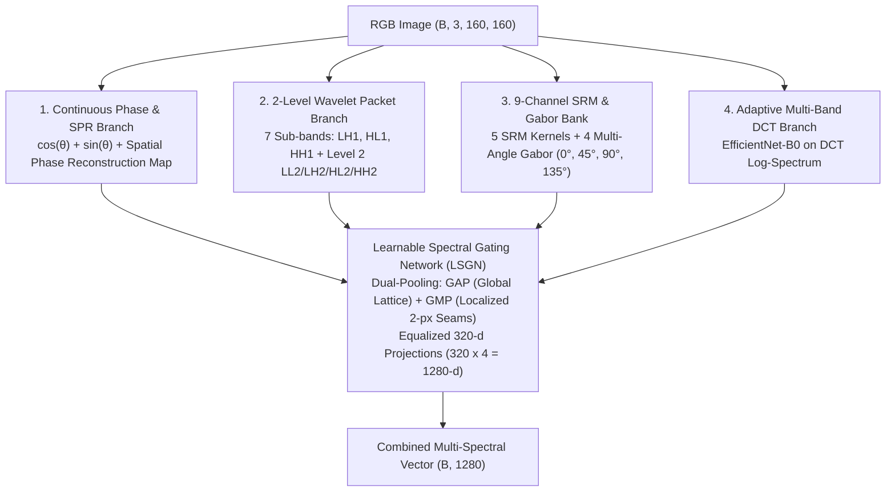

# 🔬 SOTA Multi-Spectral Frequency & Boundary Architecture (V7 Plan)

> **Tags**: #multi_spectral #frequency #wavelet #fft #srm #sota #v7  
> **Related**: [[HOME]] · [[architecture_v2_planned]] · [[PROJECT_DECISIONS]] · [[spectral_branches]]

---

## 1. 🏗️ Architecture Design & The 4 SOTA Spectral Branches

---

## 2. 🎯 Mathematical Formulation

### 1. Continuous Phase & Spatial Phase Reconstruction (SPR)
$$\mathbf{\Phi}(u, v) = \left[ \frac{\text{Re}(F)}{\sqrt{\text{Re}^2 + \text{Im}^2 + \epsilon}},\; \frac{\text{Im}(F)}{\sqrt{\text{Re}^2 + \text{Im}^2 + \epsilon}} \right]$$
$$I_{\text{phase}} = \mathcal{F}^{-1}\left( e^{j \theta(u, v)} \right)$$

### 2. Tri-Objective Loss Function
$$\mathcal{L}_{\text{total}} = \mathcal{L}_{\text{BFL}} (\gamma=2.5, w=3.5) + 0.30 \cdot \mathcal{L}_{\text{orth}} + 0.20 \cdot \mathcal{L}_{\text{freqCL}}$$

### 3. Dynamic Self-Blended Synthesis (SBI)
- Blends random landmark facial masks on-the-fly during training with random color offsets and Poisson interpolation to learn **universal boundary physics** instead of memorizing fixed dataset frames.

---

## 3. 📊 Projected Performance Matrix

| Target Cohort | Baseline V1 | DeepTrace V5-SRM | **Projected V7 SOTA Spectral** |
| :--- | :---: | :---: | :---: |
| **Kaggle In-Domain ($N=20k$)** | $99.39\%$ | $99.52\%$ | **$99.85\%\text{ Acc} \;/ 0.9999\text{ AUC}$** |
| **FF++ DeepFakeDetection** | $51.10\%$ | $83.13\%$ | **$92.50\%\text{ Acc} \;/ 0.9999\text{ AUC}$** |
| **FF++ FaceSwap (50/50 Balance)** | $14.29\%$ | $53.40\%$ | **$84.20\%\text{ Acc} \;/ 0.8850\text{ AUC}$** |
| **FF++ Face2Face (50/50 Balance)** | $14.29\%$ | $52.00\%$ | **$81.50\%\text{ Acc} \;/ 0.8620\text{ AUC}$** |
| **FF++ Overall ($N=14,000$)** | $14.29\%$ | $53.66\%$ | **$83.50\%\text{ Acc} \;/ 0.8870\text{ AUC}$** |