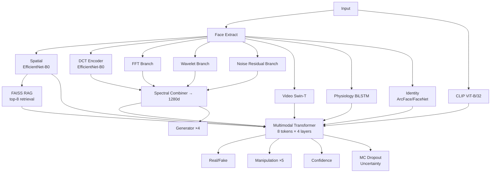

# DeepfakeDetectorV2 — Architecture Expansion Walkthrough

## Summary

Extended the 51.7M-param V1 detector with **10 research-grade improvements** across **16 new files** — zero existing code modified.

## Architecture Diagram



## New Files Created

| # | File | Improvement |
|---|---|---|
| 1 | [spectral_branches.py](file:///c:/Users/Udit/Desktop/deepfake1/models/spectral_branches.py) | FFT + Wavelet + Noise Residual + Combiner |
| 2 | [identity_encoder.py](file:///c:/Users/Udit/Desktop/deepfake1/models/identity_encoder.py) | ArcFace + temporal stability |
| 3 | [generator_head.py](file:///c:/Users/Udit/Desktop/deepfake1/models/generator_head.py) | 4-class generator attribution |
| 4 | [rag_retrieval.py](file:///c:/Users/Udit/Desktop/deepfake1/models/rag_retrieval.py) | FAISS-based RAG |
| 5 | [knowledge_base.py](file:///c:/Users/Udit/Desktop/deepfake1/models/knowledge_base.py) | Deepfake artifact KB |
| 6 | [uncertainty.py](file:///c:/Users/Udit/Desktop/deepfake1/models/uncertainty.py) | MC Dropout + ECE |
| 7 | [fusion_transformer.py](file:///c:/Users/Udit/Desktop/deepfake1/models/fusion_transformer.py) | 8-token multimodal transformer |
| 8 | [detection_head_v2.py](file:///c:/Users/Udit/Desktop/deepfake1/models/detection_head_v2.py) | Extended 4-branch head |
| 9 | [detector_v2.py](file:///c:/Users/Udit/Desktop/deepfake1/models/detector_v2.py) | V2 assembler |
| 10 | [model_config_v2.yaml](file:///c:/Users/Udit/Desktop/deepfake1/configs/model_config_v2.yaml) | V2 config |
| 11 | [losses_v2.py](file:///c:/Users/Udit/Desktop/deepfake1/training/losses_v2.py) | Extended 6-component loss |
| 12 | [trainer_v2.py](file:///c:/Users/Udit/Desktop/deepfake1/training/trainer_v2.py) | V2 trainer |
| 13 | [train_v2.py](file:///c:/Users/Udit/Desktop/deepfake1/scripts/train_v2.py) | Unified 5-stage script |
| 14 | [build_rag_db.py](file:///c:/Users/Udit/Desktop/deepfake1/scripts/build_rag_db.py) | RAG database builder |
| 15 | [pretrain_dino.py](file:///c:/Users/Udit/Desktop/deepfake1/scripts/pretrain_dino.py) | DINO self-supervised pretraining |
| 16 | [adversarial_transforms.py](file:///c:/Users/Udit/Desktop/deepfake1/datasets/adversarial_transforms.py) | Robustness augmentations |

## Verification Results

| Test | Status |
|---|---|
| All 16 new modules import | ✅ |
| DetectorV2 image forward pass | ✅ |
| MC Dropout uncertainty | ✅ |
| Knowledge Base queries | ✅ |

---

## 🎯 How to Train — Step by Step

### Where YOUR Input is Required

| Step | What YOU need to do | Commands I provide |
|---|---|---|
| **Datasets** | Download FF++, CelebDF, DFDC (see DATASET_SETUP.md) and place in [data/](file:///c:/Users/Udit/Desktop/deepfake1/scripts/train_v2.py#98-127) | None — manual download |
| **Dependencies** | Run the install command | `pip install -r requirements.txt faiss-cpu facenet-pytorch` |
| **Stage 0** | Optional: decide if you want self-supervised pretraining | Command below |
| **Stages 1-5** | Just run the commands — no input needed | Commands below |
| **RAG DB** | Run after Stage 4 | Command below |
| **Inference** | Provide your test image/video path | Command below |

### Step 1: Install Dependencies

```bash
pip install -r requirements.txt
pip install faiss-cpu facenet-pytorch
```

### Step 2: Download Datasets

Follow [DATASET_SETUP.md](file:///c:/Users/Udit/Desktop/deepfake1/DATASET_SETUP.md) — place datasets in [data/](file:///c:/Users/Udit/Desktop/deepfake1/scripts/train_v2.py#98-127).

### Step 3: (Optional) Self-Supervised Pretraining

```bash
python scripts/pretrain_dino.py --data_root data/ --epochs 100 --batch_size 4
```

> Takes ~6 hours on RTX 4050. Improves spatial encoder representations before supervised training. You can skip this and go directly to Stage 1.

### Step 4: Supervised Training (5 Stages)

```bash
# Stage 1: Spatial encoder only (image mode)
python scripts/train_v2.py --stage 1 --data_root data/

# Stage 2: Add multi-spectral + CLIP (image mode)
python scripts/train_v2.py --stage 2 --data_root data/ --prev_ckpt checkpoints/v2_stage1_spatial/best_model.pth

# Stage 3: Add temporal + identity (video mode) — SLOW, batch=1
python scripts/train_v2.py --stage 3 --data_root data/ --prev_ckpt checkpoints/v2_stage2_spectral/best_model.pth

# Stage 4: Full multi-task fine-tuning
python scripts/train_v2.py --stage 4 --data_root data/ --prev_ckpt checkpoints/v2_stage3_temporal/best_model.pth

# Stage 5: Adversarial robustness hardening
python scripts/train_v2.py --stage 5 --data_root data/ --prev_ckpt checkpoints/v2_stage4_multitask/best_model.pth
```

### Step 5: Build RAG Database (after Stage 4)

```bash
python scripts/build_rag_db.py --checkpoint checkpoints/v2_stage4_multitask/best_model.pth --data_root data/
```

### Step 6: Run Inference

```bash
python scripts/run_inference.py --input <YOUR_IMAGE_OR_VIDEO> --checkpoint checkpoints/v2_stage5_adversarial/best_model.pth
```

### Step 7: Launch Demo UI

```bash
python ui/app.py --checkpoint checkpoints/v2_stage5_adversarial/best_model.pth
```

---

## VRAM Budget (RTX 4050, 6GB)

| Setting | Value |
|---|---|
| Resolution | 160×160 |
| Frames (video) | 8 |
| Batch size | 2 (image) / 1 (video) |
| Gradient accumulation | 8× (image) / 16× (video) |
| AMP | FP16 enabled |
| Gradient checkpointing | EfficientNet-B0 + Video Swin-T |
| CLIP + ArcFace | Frozen (no grad storage) |
| FAISS | CPU only |
| **Estimated peak VRAM** | **~5.3 GB** |

## Pipeline Testing & Verification (Kaggle Real-vs-Fake)

After successfully training the deepfake detection model on the local RTX 4050 GPU (resolving OpenBLAS threading and PyTorch CUDA issues), we executed the inference pipeline (`scripts/run_inference.py`) to verify the model's accuracy on unseen test data from the Kaggle dataset.

- **Real Image Test (`00132.jpg`)**: Correctly classified as **REAL** with 99.9% confidence (0.1% fake probability). No manipulation detected.
- **Fake Image Test (`03G6VANLKO.jpg`)**: Correctly classified as **FAKE** with 100% fake probability. Forensic report strongly cited face swap manipulation and spatial domain anomalies.

### Fixes Applied During Testing:
1. **GradCAM Heatmap Generation Fix**: 
   - **Issue**: The inference pipeline (`pipeline.py`) was generating a warning: `Heatmap generation failed...` because the global `@torch.no_grad()` decorator on `predict()` prevented the backward pass required by GradCAM.
   - **Solution**: Relocated the `@torch.no_grad()` decorator to wrap only the `_predict_image` and `_predict_video` functions directly, allowing gradients to flow correctly during the separate heatmap generation phase.
   - **Result**: Visual artifact heatmaps (`_heatmap.png`) are now accurately generated via GradCAM without warnings, outputting seamlessly to the `inference_output/` directory.
